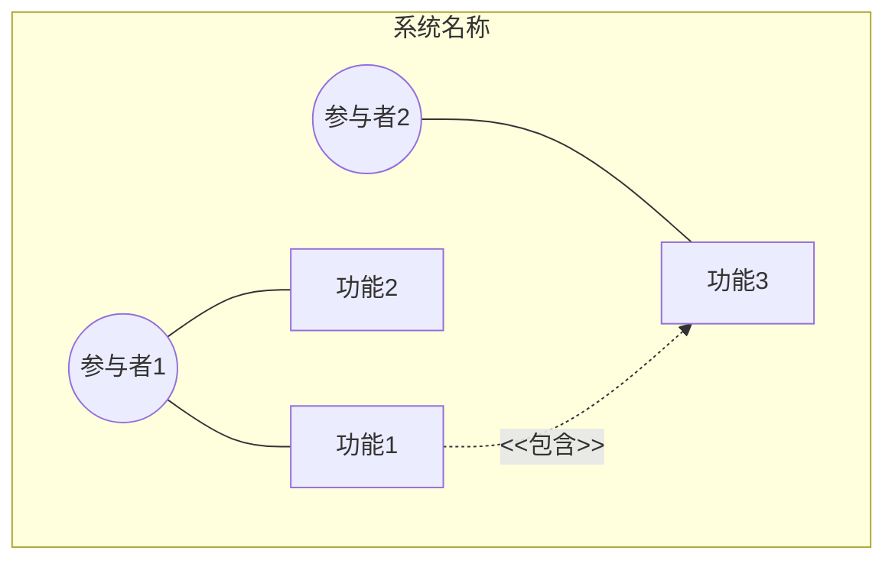
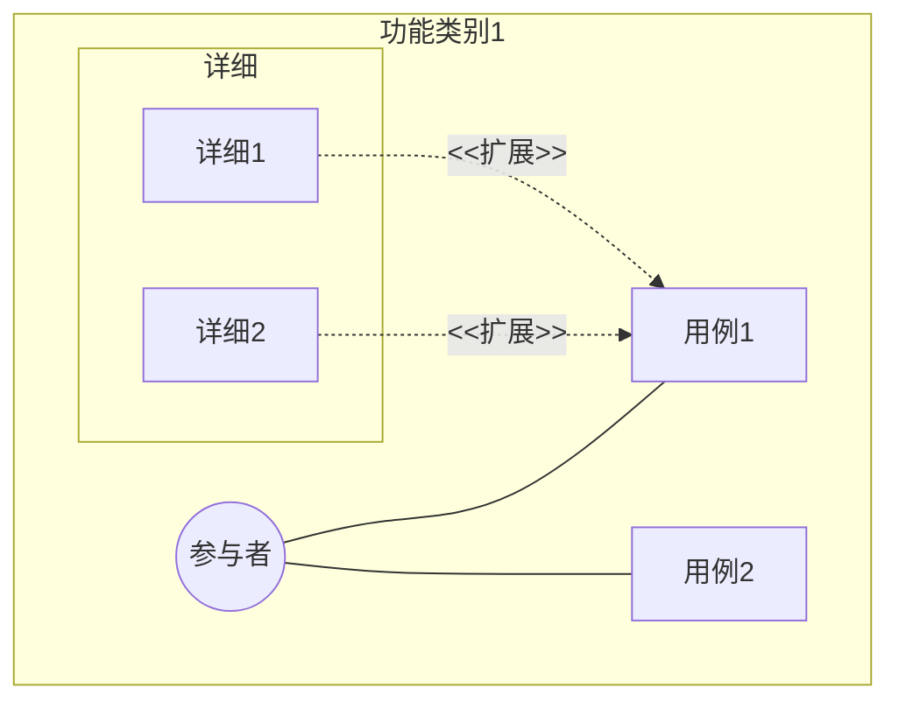
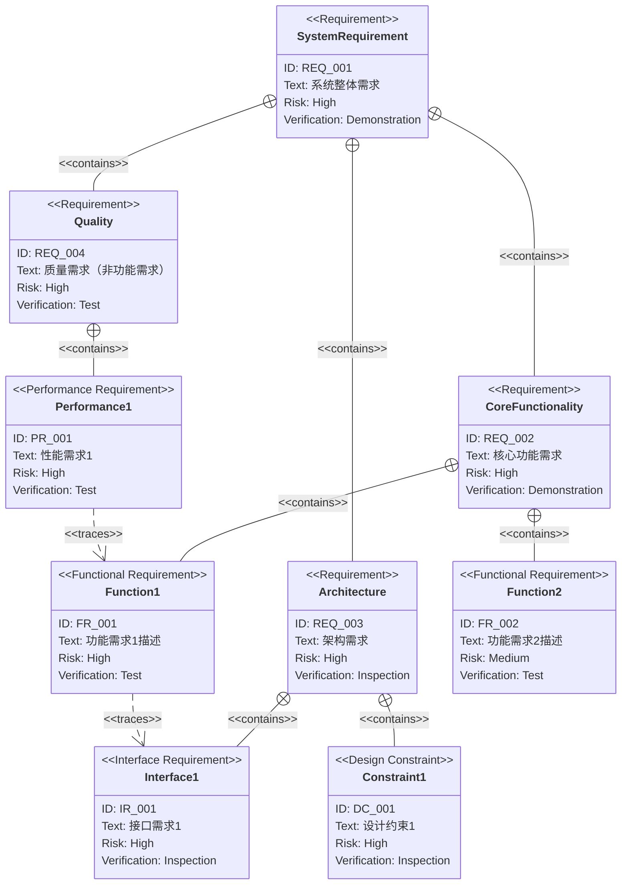
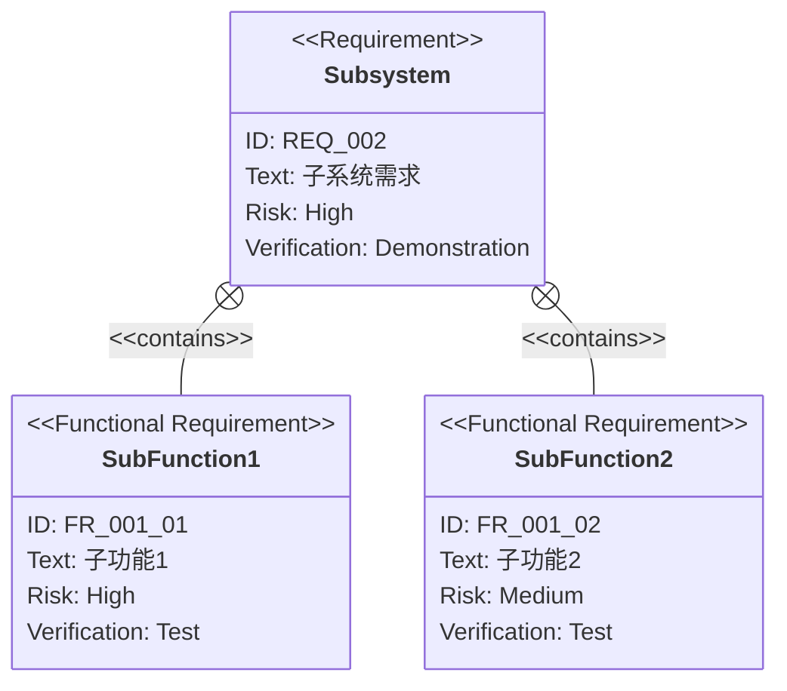
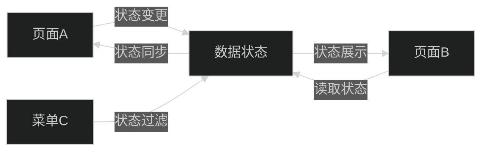
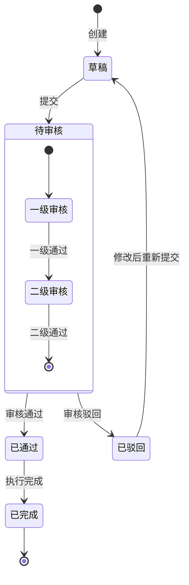

# PRD（产品需求文档）模板

此文档是 `${SDD_ROOT}/requirement/` 目录下创建PRD（产品需求文档）的模板。
文件名应为 `{feature-name}.md`。

> **注意**：此模板为技能的回退模板。
> 在项目中使用时，请根据项目结构进行自定义，
> 并保存为 `${SDD_ROOT}/PRD_TEMPLATE.md`。

## 与规格说明书/设计文档的区别

| 文档             | SDD阶段          | 职责与焦点                                               | 抽象度      |
|--------------------|------------------|-----------------------------------------------------|----------|
| `requirement/*.md` | **规格化（Specify）** | **"做什么""为什么做"** - 定义业务需求，不含技术细节            | 最高（抽象）  |
| `xxx_spec.md`      | **规格化（Specify）** | **"做什么"** - 定义系统的抽象结构与行为，不含技术细节        | 高（抽象）   |
| `xxx_design.md`    | **计划/设计（Plan）**  | **"如何实现"** - 实现抽象规格的具体技术设计，确保设计决策的透明性 | 中~低（具体） |

---

# {功能名称} 需求规格说明书 `<MUST>`

## 概述 `<MUST>`

简要说明此文档的目的与范围。

---

# 1. 需求图阅读说明 `<RECOMMENDED>`

## 1.1. 需求类型

- **requirement**：一般需求
- **functionalRequirement**：功能需求
- **performanceRequirement**：性能需求
- **interfaceRequirement**：接口需求
- **designConstraint**：设计约束

## 1.2. 风险等级

- **High**：高风险（业务关键、实现困难）
- **Medium**：中风险（重要但存在替代方案）
- **Low**：低风险（锦上添花）

## 1.3. 验证方法

- **Analysis**：通过分析验证
- **Test**：通过测试验证
- **Demonstration**：通过演示验证
- **Inspection**：通过审查验证

## 1.4. 关系类型

- **contains**：包含关系（父需求包含子需求）
- **derives**：派生关系（需求派生出另一需求）
- **satisfies**：满足关系（元素满足需求）
- **verifies**：验证关系（测试用例验证需求）
- **refines**：细化关系（对需求进行更详细的定义）
- **traces**：追溯关系（需求间的可追溯性）

---

# 2. 需求清单 `<MUST>`

## 2.1. 用例图（概览） `<RECOMMENDED>`

展示主要功能与参与者关系的概览图。

## 2.2. 用例图（详细） `<OPTIONAL>`

### {功能类别1}

## 2.3. 功能列表（文本格式） `<MUST>`

- 功能类别1
    - 子功能1-1
        - 详细1-1-1
        - 详细1-1-2
    - 子功能1-2
- 功能类别2
    - 子功能2-1

---

# 3. 需求图（SysML需求图） `<MUST>`

## 3.1. 整体需求图

## 3.2. 主要子系统详细图 `<OPTIONAL>`

### {子系统名称}

---

# 4. 需求详细说明 `<MUST>`

## 4.1. 功能需求

> **原始内容保护说明**：用户原始需求文本保持原样，AI补充的内容用 **【补充·策略师】**、**【补充·体验专家】** 或 **【补充·策略师+体验专家】** 标记区分归属。
> 每个章节结构：先呈现用户原文 → 分隔线 → 带归属的【补充】标记的AI增量内容。

### FR_001: {功能需求名称}

{功能的详细说明}

**包含的功能：**

- FR_001_01: {子功能1}
- FR_001_02: {子功能2}

**验证方法：** 测试

---

**【补充·策略师】业务规则：**
- [CRUD完整性、流程闭环、数据一致性、权限完整性、状态机完整性]

**【补充·体验专家】异常状态处理：**
- [异常状态、空状态、二次确认、输入校验、加载状态、并发防重复]

**【补充·策略师+体验专家】边界条件：**
- 异常操作：[重复提交、中途取消等]
- 异常环境：[网络断开、服务端错误等]
- 极端负载：[大量并发、数据量超预期等]
- 权限边界：[未登录访问、角色不匹配等]
- 状态边界：[状态回退合法性、并发状态变更冲突、状态变更副作用、异常导致状态不一致]

### FR_002: {功能需求名称}

{功能的详细说明}

**验证方法：** 测试

## 4.2. 性能需求 `<OPTIONAL>`

### PR_001: {性能需求名称}

{性能需求的详细说明与目标值}

**验证方法：** 测试

## 4.3. 接口需求 `<OPTIONAL>`

### IR_001: {接口需求名称}

{接口需求的详细说明}

**验证方法：** 审查

## 4.4. 设计约束 `<OPTIONAL>`

### DC_001: {设计约束名称}

{设计约束的详细说明}

**验证方法：** 审查

---

# 5. 状态流转 `<RECOMMENDED>`

> **注意**：当需求中存在有状态的实体（如订单、任务、审批流程等），此章节变为必填。
> **原始内容保护说明**：用户原文中关于状态的描述保持原样，AI补充的状态流转路径用 **【补充·策略师】** 或 **【补充·体验专家】** 标记区分归属。

## 5.1. 状态定义与页面映射 `<RECOMMENDED>`

列出有状态实体的所有状态，以及每个状态在哪些页面/菜单中出现。

| 实体 | 状态 | 所在页面/菜单 | 触发操作 | 说明 |
|------|------|--------------|----------|------|
| [实体名] | [状态名] | [页面A, 页面B] | [操作X触发进入此状态] | [状态含义/限制] |

---

**【补充·策略师】完整状态映射：**
- [如用户原文仅描述部分状态，补充缺失状态的页面映射及状态机转换路径]

## 5.2. 数据状态与关联关系 `<RECOMMENDED>`

描述同一数据在不同页面/菜单中的状态表现及关联关系。

| 数据实体 | 主页面状态 | 关联页面/菜单 | 关联页面状态 | 数据一致性要求 |
|----------|-----------|--------------|-------------|--------------|
| [实体名] | [页面A上的状态] | [页面B, 菜单C] | [在关联页面上的状态表现] | [跨页面状态是否需同步] |

---

**【补充·策略师】跨页面状态关联：**
- [如用户原文未描述跨页面关联，补充状态同步/一致性要求]

## 5.3. 状态行为差异表 `<RECOMMENDED>`

描述同一功能/元素在不同状态下的不同行为和表现。

| 实体 | 功能/元素 | 状态A | 状态B | 状态C | ... |
|------|----------|-------|-------|-------|-----|
| [实体名] | [按钮/字段/操作] | [行为描述] | [行为描述] | [行为描述] | |
| [实体名] | [权限/可见性] | [可见/可操作] | [隐藏/禁用] | [只读] | |

---

**【补充·体验专家】状态行为覆盖：**
- [如用户原文未覆盖所有状态下的行为差异，补充缺失状态的差异描述（按钮禁用、字段只读、可见性变化等交互细节）]

## 5.4. 状态流转图 `<RECOMMENDED>`

使用Mermaid stateDiagram-v2展示实体的完整状态流转路径。

> **Mermaid语法要求**：
> - 使用 `stateDiagram-v2` 格式（支持嵌套状态和备注）
> - 每个转换标注触发事件/操作
> - 包含初始状态 `[*]` 和终态 `[*]`
> - 对复杂状态使用嵌套 `state` 块

---

# 6. 约束条件 `<OPTIONAL>`

## 6.1. 技术约束

- 技术约束

## 6.2. 业务约束

- 业务约束（进度、预算等）

---

# 7. 前提条件 `<OPTIONAL>`

- 此功能正常运行的前提
- 依赖的其他系统/功能

---

# 8. 范围外 `<OPTIONAL>`

以下内容不在本PRD范围内：

- 此功能不包含的内容
- 未来可能考虑但本次排除的内容

---

# 9. 术语表 `<RECOMMENDED>`

> **注意**：如果术语表内容较多，建议作为独立文件（`glossary.md`）管理。

| 术语   | 定义   |
|--------|--------|
| [术语] | [定义] |

---

# 10. 待确认问题 `<MUST>`

列出需求中模糊、缺失、矛盾的点，需与利益相关方确认后才能最终定稿。

| 序号 | 问题 | 类别 | 影响范围 | 建议确认方式 |
|------|------|------|----------|-------------|
| Q-001 | [问题描述] | 模糊/缺失/矛盾 | [受影响的FR/NFR] | [建议向谁确认、如何确认] |

**类别说明**：
- **模糊**：需求描述有多种理解方式，不同理解导致不同实现
- **缺失**：必要信息未提及（如未说明排序规则、未定义失败策略）
- **矛盾**：多处描述互相冲突（如一处说"必须实时"，一处说"可延迟5秒"）
- **状态缺失**：有状态实体未定义完整状态机，或转换路径不完整（源自第5章）

---

# 11. 版本历史 `<MUST>`

记录PRD的每次修改和定版操作。

| 版本 | 日期 | 操作 | 变更摘要 | 变更章节 |
|------|------|------|----------|----------|
| v1.0 | {创建日期} | 创建 | 初次生成PRD | 全文 |
| v1.1 | {修改日期} | 修改 | {变更摘要，如"修改FR-003优先级、新增FR-006"} | {变更章节编号，如"4.1、2.3、3.1"} |
| v1.2 | {定版日期} | 定版 | PRD定版，status变为approved | 全文 |

**版本命名规则**：
- 首次生成：v1.0
- 每次迭代修改：minor版本递增（v1.0 → v1.1 → v1.2 → ...）
- 定版：version值不变，status从draft变为approved
- 覆盖重新生成：version重置为v1.0

**日期规则**：
- created：保留首次创建日期，迭代修改不修改
- updated：每次迭代修改或定版时更新为当前日期

---

# 章节必要性标记说明

| 标记             | 含义 | 说明                 |
|-----------------|------|--------------------|
| `<MUST>`        | 必填 | 所有PRD必须包含 |
| `<RECOMMENDED>` | 推荐 | 尽可能包含  |
| `<OPTIONAL>`    | 可选 | 按需包含     |

---

# 编写指南

## 应包含的内容

- ✅ 概述与目的
- ✅ 用例图（概览与详细）
- ✅ SysML需求图（requirementDiagram语法）
- ✅ 需求详细说明（功能需求、性能需求、接口需求、设计约束）
- ✅ 需求间关系（contains、derives、satisfies、verifies、refines、traces）
- ✅ 约束条件与前提条件
- ✅ 明确标注范围外内容
- ✅ 状态流转（有状态实体时必填）
- ✅ 术语表
- ✅ 版本历史（每次迭代修改和定版有记录）

## 不应包含的内容（→ 规格说明书 / 设计文档）

- ❌ 技术实现细节
- ❌ 架构与模块结构
- ❌ 技术栈选择
- ❌ API定义与类型定义
- ❌ 数据库Schema

---

# 项目自定义指南

为项目自定义此模板时，请更新以下内容：

1. **需求ID命名规范**：根据项目约定调整（如使用REQ/FR/PR/IR/DC之外的前缀）
2. **风险等级分类**：根据项目的风险评估标准调整
3. **验证方法分类**：根据项目的验证流程调整
4. **用例图样式**：根据项目的参与者与功能结构调整
5. **术语表管理方式**：决定是否作为独立文件管理或在PRD内包含

---

**此PRD是AI代理在规格化（Specify）阶段参考的业务需求的唯一真实来源。**