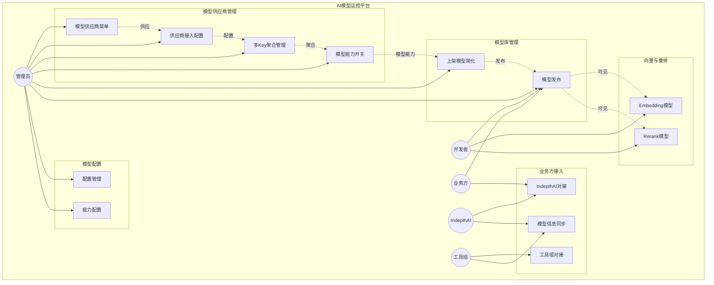
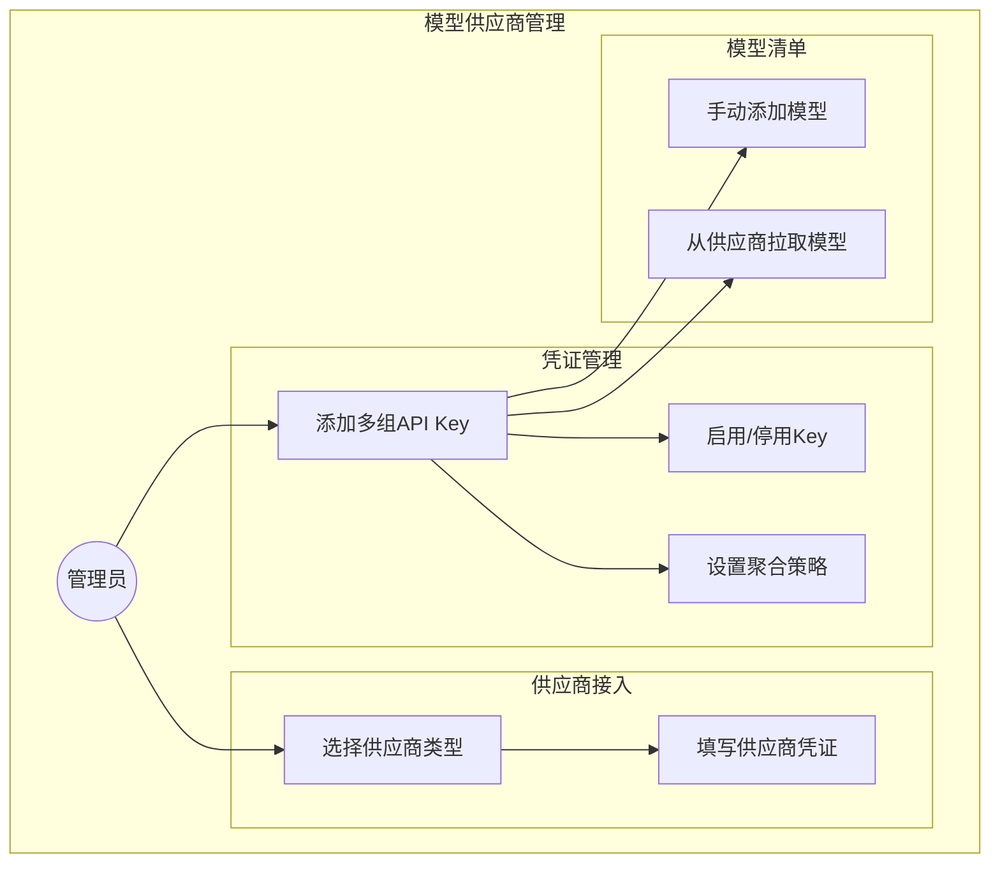
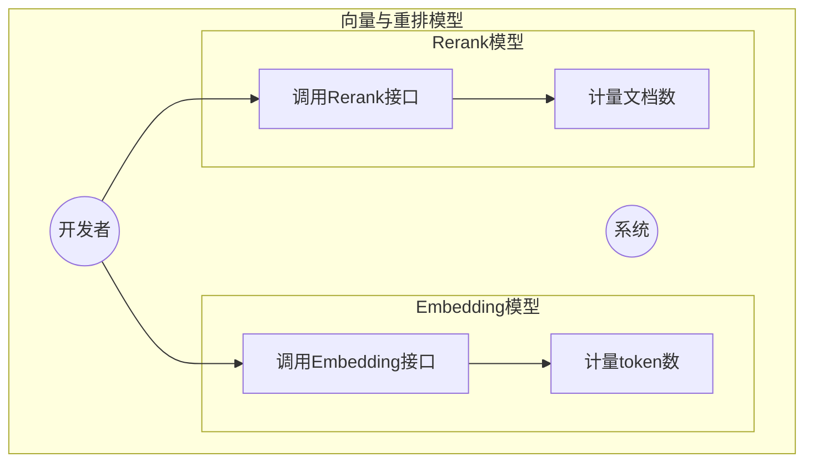
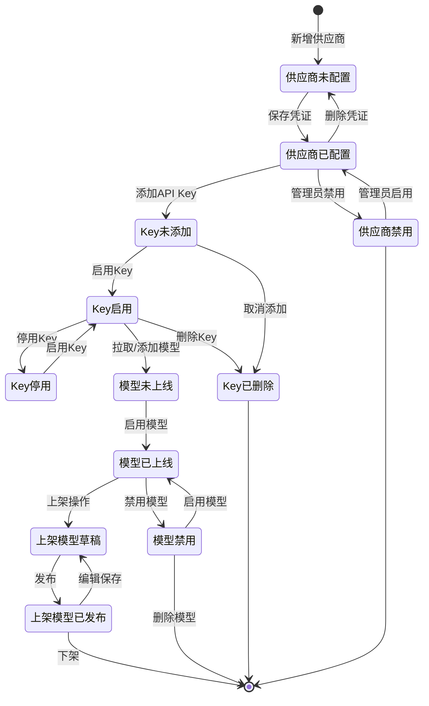

# Sprint2\_模型运控平台需求规格说明书 `<MUST>`

## 概述 `<MUST>`

本文档为 AI 模型运控平台 Sprint 2 的需求规格说明书，聚焦以下核心交付目标：

- **模型供应商扩容**：支持 10 个供应商（OpenAI / Azure OpenAI / DeepSeek / 智谱GLM / Anthropic / Google Gemini / 阿里云百炼 / 火山方舟 / OpenRouter / 鼎捷自研）
- **向量能力补齐**：Embedding / Rerank 模型支持与调用
- **业务方接入**：IndepthAI 和工具组两条业务方接入链路
- **接口文档**：对外接口文档上线 ---本期不做
- **模型配置**：模型配置模块上线（支持 chat / embedding / rerank 维度的费率配置 + 能力配置）

**迭代周期**：2026-05-04 \~ 2026-05-30（4 周）

**验收标准**：

- 新增「模型供应商」菜单上线，10 个供应商可独立完成接入配置
- 「模型库 → 上架模型」表单瘦身为业务发布动作
- 模型空间能展示 Embedding / Rerank 模型并通过 Key 调用成功
- IndepthAI 完成对接联调并跑通 chat completions
- 工具组凭 GET /platform/v1/models 拉到完整模型清单 + 关键变更 webhook 推送可用
- 模型配置模块上线（名称改为模型配置）
- 8 项优化项中 P0 100% 修复，P1 至少完成 3 项

***

# 1. 需求图阅读说明 `<RECOMMENDED>`

## 1.1. 需求类型

- **requirement**：一般需求
- **functionalRequirement**：功能需求
- **performanceRequirement**：性能需求
- **interfaceRequirement**：接口需求
- **designConstraint**：设计约束

## 1.2. 风险等级

- **High**：高风险（业务关键、实现困难）
- **Medium**：中风险（重要但存在替代方案）
- **Low**：低风险（锦上添花）

## 1.3. 验证方法

- **Analysis**：通过分析验证
- **Test**：通过测试验证
- **Demonstration**：通过演示验证
- **Inspection**：通过审查验证

## 1.4. 关系类型

- **contains**：包含关系（父需求包含子需求）
- **derives**：派生关系（需求派生出另一需求）
- **satisfies**：满足关系（元素满足需求）
- **verifies**：验证关系（测试用例验证需求）
- **refines**：细化关系（对需求进行更详细的定义）
- **traces**：追溯关系（需求间的可追溯性）

***

# 2. 需求清单 `<MUST>`

## 2.1. 用例图（概览） `<RECOMMENDED>`

## 2.2. 用例图（详细） `<OPTIONAL>`

### 模型供应商管理

### 向量模型与重排

## 2.3. 功能列表（文本格式） `<MUST>`

**模型供应商管理**

- 新增独立「模型供应商」菜单
  - 支持10个供应商类型选择
  - 凭证管理（多API Key + 聚合策略）
  - 可用模型清单管理（自动拉取/手动添加）
  - 模型详情：能力开关 ---放到模型配置模块做

**模型库管理**

- 「模型库 → 上架模型」表单简化
  - 字段缩至5-6个
  - 技术配置项全部移除
  - 自动带入模型类型、上下文窗口、能力开关等只读信息

**向量与重排模型**

- Embedding模型支持
  - 模型空间展示向量模型Tab
  - API Key绑定与计量
- Rerank模型支持
  - 模型空间展示重排模型Tab
  - API Key绑定与计量

**业务方接入**

- IndepthAI对接
  - 脚本批量上架
  - 接入点配置
  - 租户级API Key发放
- 工具组对接
  - 测试接入点
  - 模型信息查询接口
  - 模型变更事件推送

**模型配置**

- chat/embedding/rerank维度费率配置
- 模型能力配置（Tool Call / Vision / 结构化输出 / 流式 / Reasoning）
- OM云市场查询接口 ---本期不做

***

# 3. 需求图（SysML需求图） `<MUST>`

## 3.1. 整体需求图

```mermaid
requirementDiagram
    requirement SystemRequirement {
        id: REQ_001
        text: "AI模型运控平台Sprint2核心需求"
        risk: high
        verifymethod: demonstration
    }

    requirement SupplierExpansion {
        id: REQ_002
        text: "模型供应商扩容到10个供应商"
        risk: high
        verifymethod: test
    }

    requirement VectorCapability {
        id: REQ_003
        text: "向量能力补齐（Embedding/Rerank）"
        risk: high
        verifymethod: test
    }

    requirement BusinessIntegration {
        id: REQ_004
        text: "业务方接入（IndepthAI/工具组）"
        risk: high
        verifymethod: test
    }

    requirement ConfigModule {
        id: REQ_006
        text: "模型配置模块上线"
        risk: medium
        verifymethod: test
    }

    functionalRequirement FR_001 {
        id: FR_001
        text: "新增「模型供应商」菜单，支持10个供应商接入配置"
        risk: high
        verifymethod: test
    }

    functionalRequirement FR_002 {
        id: FR_002
        text: "「模型库 → 上架模型」表单简化为业务发布动作"
        risk: high
        verifymethod: test
    }

    functionalRequirement FR_003 {
        id: FR_003
        text: "Embedding模型支持（接口、计量、模型空间展示）"
        risk: high
        verifymethod: test
    }

    functionalRequirement FR_004 {
        id: FR_004
        text: "Rerank模型支持（接口、计量、模型空间展示）"
        risk: high
        verifymethod: test
    }

    functionalRequirement FR_005 {
        id: FR_005
        text: "IndepthAI对接联调"
        risk: high
        verifymethod: test
    }

    functionalRequirement FR_006 {
        id: FR_006
        text: "工具组模型信息同步接口+webhook推送"
        risk: high
        verifymethod: test
    }

    functionalRequirement FR_009 {
        id: FR_009
        text: "模型配置模块（chat/embedding/rerank费率配置+能力配置）"
        risk: medium
        verifymethod: test
    }

    functionalRequirement FR_010 {
        id: FR_010
        text: "模型配置模块-能力开关配置"
        risk: medium
        verifymethod: test
    }

    performanceRequirement PR_001 {
        id: PR_001
        text: "10个供应商接入配置可独立完成"
        risk: high
        verifymethod: test
    }

    performanceRequirement PR_002 {
        id: PR_002
        text: "Embedding/Rerank调用成功率>=99.5%"
        risk: high
        verifymethod: test
    }

    interfaceRequirement IR_001 {
        id: IR_001
        text: "GET /platform/v1/models 模型信息查询接口"
        risk: high
        verifymethod: inspection
    }

    interfaceRequirement IR_002 {
        id: IR_002
        text: "模型变更webhook推送接口"
        risk: medium
        verifymethod: inspection
    }

    designConstraint DC_001 {
        id: DC_001
        text: "协议适配以mop-go已有适配器为底，不做新协议开发"
        risk: high
        verifymethod: inspection
    }

    designConstraint DC_002 {
        id: DC_002
        text: "上架仍是管理员动作，开发者只能用已发布模型"
        risk: medium
        verifymethod: inspection
    }

    SystemRequirement - contains -> SupplierExpansion
    SystemRequirement - contains -> VectorCapability
    SystemRequirement - contains -> BusinessIntegration
    SystemRequirement - contains -> ConfigModule

    SupplierExpansion - contains -> FR_001
    SupplierExpansion - contains -> FR_002
    VectorCapability - contains -> FR_003
    VectorCapability - contains -> FR_004
    BusinessIntegration - contains -> FR_005
    BusinessIntegration - contains -> FR_006
    ConfigModule - contains -> FR_009
    ConfigModule - contains -> FR_010

    SupplierExpansion - contains -> PR_001
    VectorCapability - contains -> PR_002

    BusinessIntegration - contains -> IR_001
    BusinessIntegration - contains -> IR_002

    FR_001 - traces -> DC_001
    FR_002 - traces -> DC_002
```

***

# 4. 需求详细说明 `<MUST>`

## 4.1. 功能需求

> **原始内容保护说明**：用户原始需求文本保持原样，AI补充的内容用 **【补充·策略师】**、**【补充·体验专家】** 或 **【补充·策略师+体验专家】** 标记区分归属。

### FR\_001: 新增「模型供应商」菜单

**原始内容**：

- 位置：模型管理 → 新增「模型供应商」一级菜单（与「模型库」「模型配置」并列）
- 职责边界：「模型供应商」是模型源数据中心——管供应商账号、凭证、可调用的模型清单
- 菜单里不再区分"鼎捷模型 / 第三方外部 API"，鼎捷自研也是供应商之一

**包含的功能：**

- FR\_001\_01: 供应商类型选择（10个供应商）
- FR\_001\_02: 凭证管理（多API Key + 聚合策略）
- FR\_001\_03: 可用模型清单（自动拉取/手动添加）

**验证方法：** 测试

***

**【补充·策略师】业务规则：**

- **CRUD完整性**：
  - Create：管理员可创建供应商配置、添加API Key、添加模型
  - Read：所有角色可查看供应商信息、模型清单
  - Update：管理员可编辑供应商配置、启用/停用Key
  - Delete：管理员可删除供应商配置、删除API Key、删除模型
- **流程闭环**：供应商配置→模型拉取→上架发布，流程完整
- **数据一致性**：同一模型ID在同一供应商内全局唯一，避免计费混乱
- **权限完整性**：管理员操作供应商配置，开发者仅可查看和使用已发布模型

**【补充·体验专家】异常状态处理：**

- **空状态**：模型清单为空时显示"暂无可用模型，请从供应商拉取或手动添加"
- **网络异常**：拉取模型失败时显示"网络连接失败，请检查网络后重试"，保留重试按钮
- **输入校验**：API Key格式校验，Key长度最小8位；模型ID必填，不得重复

**【补充·策略师+体验专家】边界条件：**

- **异常操作**：重复拉取模型时提示"模型已存在，是否覆盖？"；删除有调用记录的Key时提示"该Key存在使用记录，删除后历史记录将无法定位"
- **极端负载**：单供应商最多绑定1000个API Key，超出提示"Key数量已达上限"

***

### FR\_002: 「模型库 → 上架模型」表单简化

**原始内容**：

- 表单字段缩到5-6个，技术配置项（baseURL / API密钥 / 供应商特殊字段 / 能力开关）全部不再出现
- 「模型服务生态」「模型来源（鼎捷模型 / 外部 API）」枚举在UI与schema上均已删除
- 选完供应商和模型后，自动从「模型供应商」菜单带入模型类型、上下文窗口、能力开关等只读信息

**验证方法：** 测试

***

**【补充·策略师】业务规则：**

- **流程闭环**：从供应商菜单选择模型→补充业务描述/分类→发布，流程完整
- **数据一致性**：上架模型信息与供应商菜单数据同步，来源单一

**【补充·体验专家】异常状态处理：**

- **二次确认**：点击发布按钮时弹出确认框，显示"即将发布以下模型：{模型名称}，发布后业务方可见"     --无
- **加载状态**：发布操作进行中显示loading状态，超时30秒提示"发布超时，请稍后重试"    ---无

***

### FR\_003: Embedding模型支持

**原始内容**：

- Sprint1网关已声明/v1/embeddings接口，本 Sprint 打通调用与计量
- 模型空间顶部分类Tab新增「向量模型」
- Embedding计量按token

**验证方法：** 测试

***

**【补充·策略师】业务规则：**

- **调用日志**：记录实际承接请求的上架模型实例、模型供应商、模型用途（embedding）、计量单位数（token数）、租户标识、请求ID
- **限流维度**：QPM/点数对所有用途统一适用

**【补充·体验专家】异常状态处理：**

- **接口调用失败**：返回错误码+提示文案，使用记录无此次计费
- **用途不匹配**：chat模型调/v1/embeddings时返回"模型用途与接口不匹配"

***

### FR\_004: Rerank模型支持

**原始内容**：

- 模型空间顶部分类Tab新增「重排模型」
- Rerank计量按(1+文档数)
- Rerank接口结果按相关性得分降序排列，top\_n缺省值为传入文档数

**验证方法：** 测试

***

**【补充·策略师】业务规则：**

- **调用日志**：记录文档数、相关性得分
- **限流**：Rerank接口结果按文档数计量

**【补充·体验专家】异常状态处理：**

- **文档数超限**：返回"Rerank文档数超上限，当前最大支持{数量}个文档"
- **query超长**：返回"query长度超限，最大支持{数量}token"

***

### FR\_005: IndepthAI对接

**原始内容**：

- 走"先脚本上架 + 接入点 + 租户级API Key"路径
- 先归纳技能中心租户的模型订阅情况、区分公开/私有
- 脚本批量上架、配置接入点和租户级API Key
- IndepthAI侧改造：调用方式baseURL/API Key/model、可用模型列表重设计、code字段加ep-前缀

**验证方法：** 测试

***

**【补充·策略师】业务规则：**

- **租户隔离**：多租户环境隔离，IndepthAI仅可访问其租户下的模型
- **接入点配置**：每个接入点对应具体模型实例

**【补充·体验专家】异常状态处理：**

- **接入失败**：显示具体失败原因（认证失败/模型不存在/额度不足）
- **配置错误**：提供配置检查清单，引导用户逐项排查

***

### FR\_006: 工具组对接

**原始内容**：

- 提供测试接入点：覆盖chat/embedding/rerank三种用途各至少1个模型
- 提供模型信息查询接口：GET /platform/v1/models
- 提供模型信息变更事件推送：关键变更通过webhook推送

**验证方法：** 测试

***

**【补充·策略师】业务规则：**

- **接口鉴权**：查询接口鉴权方式与对外API一致
- **推送策略**：双方约定回调地址、签名校验、重试机制
- **推送内容**：仅含变更摘要（模型ID+变更类型），详情通过查询接口拉取

**【补充·体验专家】异常状态处理：**

- **webhook推送失败**：自动重试3次，间隔1分钟/5分钟/30分钟      ---暂不做
- **签名校验失败**：记录异常日志，通知管理员         ---暂不做

***

### FR\_009: 模型配置模块-费率配置

**原始内容**：

- 支持chat/embedding/rerank维度的费率配置
- chat类填输入费率+输出费率
- embedding类填向量费率
- rerank类填重排费率

**验证方法：** 测试

***

**【补充·策略师】业务规则：**

- **费率精度**：费率精确到4位小数  
- **计费单位**：token计费按实际消耗计量

**【补充·体验专家】异常状态处理：**

- **费率为空**：提示"请配置完整费率信息"
- **费率格式错误**：提示"费率必须为正数，保留最多4位小数"

***

### FR\_010: 模型配置模块-能力开关配置

**原始内容**：

- 模型详情面板可选择推理，视觉,工具，联网，重排，嵌入

**验证方法：** 测试

***

## 4.2. 性能需求 `<OPTIONAL>`

### PR\_001: 10个供应商接入配置可独立完成

**验证方法：** 测试

### PR\_002: Embedding/Rerank调用成功率>=99.5%

**验证方法：** 测试

## 4.3. 接口需求 `<OPTIONAL>`

### IR\_001: GET /platform/v1/models 模型信息查询接口

**接口字段**：

- 供应商
- 模型ID
- 模型类型（chat/embedding/rerank）
- 能力开关
- 定价
- 上下文窗口

**验证方法：** 审查

### IR\_002: 模型变更webhook推送接口

**推送内容**：模型ID+变更类型

**验证方法：** 审查

## 4.4. 设计约束 `<OPTIONAL>`

### DC\_001: 协议适配以mop-go已有适配器为底

不做：协议适配器源码改造（如新增供应商需要走mop-go上游PR流程）

**验证方法：** 审查

### DC\_002: 上架仍是管理员动作

开发者只能用已发布的模型，不能自助上架

**验证方法：** 审查

***

# 5. 状态流转 `<RECOMMENDED>`

## 5.1. 状态定义与页面映射 `<RECOMMENDED>`

| 实体            | 状态  | 所在页面/菜单     | 触发操作    | 说明            |
| ------------- | --- | ----------- | ------- | ------------- |
| 模型供应商         | 未配置 | 模型供应商菜单     | 新增供应商   | 初始状态          |
| 模型供应商         | 已配置 | 模型供应商菜单     | 保存供应商凭证 | 供应商可用的状态      |
| 模型供应商         | 禁用  | 模型供应商菜单     | 管理员禁用   | 暂停使用          |
| 模型供应商-API Key | 启用  | 模型供应商-供应商详情 | 启用Key   | 参与路由          |
| 模型供应商-API Key | 停用  | 模型供应商-供应商详情 | 停用Key   | 不参与路由         |
| 模型            | 未上线 | 模型供应商-模型清单  | 添加模型    | 初始状态          |
| 模型            | 已上线 | 模型供应商-模型清单  | 启用模型    | 对业务方可见        |
| 模型            | 禁用  | 模型供应商-模型清单  | 禁用模型    | /v1/models不返回 |
| 上架模型          | 草稿  | 模型库-上架模型    | 保存未发布   | 暂存状态          |
| 上架模型          | 已发布 | 模型库-上架模型    | 发布操作    | 业务方可见         |

***

**【补充·策略师】完整状态映射：**

- **API Key路由状态**：启用→停用→删除，启用状态下参与随机/轮询
- **模型可见性状态**：禁用后所有调用直接拒绝，/v1/models不再返回

## 5.2. 数据状态与关联关系 `<RECOMMENDED>`

| 数据实体    | 主页面状态 | 关联页面/菜单  | 关联页面状态  | 数据一致性要求     |
| ------- | ----- | -------- | ------- | ----------- |
| 模型供应商   | 已配置   | 模型库-上架模型 | 可选供应商   | 上架模型引用供应商ID |
| API Key | 启用    | 使用记录     | 显示Key别名 | 调用时关联Key    |
| 模型      | 已上线   | 模型空间     | 显示模型卡片  | 上架模型引用模型ID  |

***

**【补充·策略师】跨页面状态关联：**

- 供应商状态变更（禁用）需同步影响该供应商下所有模型的上架状态
- 模型禁用后，使用记录中该模型的调用记录需保留，但新增调用被拒绝

## 5.3. 状态行为差异表 `<RECOMMENDED>`

| 实体      | 功能/元素        | 未配置/草稿 | 已配置/已发布 | 禁用   | 说明       |
| ------- | ------------ | ------ | ------- | ---- | -------- |
| 供应商     | 调用           | 不可调用   | 可调用     | 拒绝调用 | 状态影响可用性  |
| API Key | 路由           | 不参与    | 参与路由    | 不参与  | 启用才参与聚合  |
| 模型      | /v1/models返回 | 不返回    | 返回      | 不返回  | 禁用不暴露    |
| 模型      | 调用           | 拒绝     | 允许      | 拒绝   | 状态决定可调用性 |
| 上架模型    | 业务方可见性       | 不可见    | 可见      | 不可见  | 发布状态决定   |

***

**【补充·体验专家】状态行为覆盖：**

- **供应商禁用**：页面显示"已禁用"标签，编辑按钮禁用
- **API Key停用**：Key列表显示"已停用"标签，调用时切到其他启用Key
- **模型禁用**：模型卡片显示"已下线"标签，不可点击调用

## 5.4. 状态流转图 `<RECOMMENDED>`

***

# 6. 约束条件 `<OPTIONAL>`

## 6.1. 技术约束

- 协议适配以mop-go已有适配器为底，不做新协议开发
- mop-go源码层支持10个供应商的协议适配器
- 后端在mop-go中按所选供应商启用对应适配器

## 6.2. 业务约束

- 迭代周期：2026-05-04 \~ 2026-05-30（4周）

***

# 7. 前提条件 `<OPTIONAL>`

- Sprint1网关基础能力已交付（API Key鉴权、QPM/点数限流）
- mop-go已有适配器支持10个供应商
- 工具组评测平台已对接准备就绪
- IndepthAI侧改造需求已确认

***

# 8. 范围外 `<OPTIONAL>`

以下内容不在本PRD范围内：

- **安全围栏**：请求/响应埋点、实例策略路由开口、租户上下文透传、请求ID全链路贯穿 ---本期不做
- **接口文档**：对外接口文档 ---本期不做
- **OM云市场查询接口** ---本期不做
- F1/F2/F3（汇总看板/审批流/IP白名单+有效期）—— 继续顺延
- F4/F5/F6（限流/熔断/配置页）+ Claude Code接入文档 —— 拆出至顺延需求\_网关管控与客户端文档.md
- 协议适配器源码改造（如新增供应商需走mop-go上游PR流程）
- "实例分组"概念（如"OpenRouter-付费"和"OpenRouter-试用"归组）—— 建议放Q3智能路由
- 实例"健康度自动检测" —— 建议放后续Sprint，与熔断同步做

***

# 9. 术语表 `<RECOMMENDED>`

| 术语              | 定义                                            |
| --------------- | --------------------------------------------- |
| 模型供应商           | 提供AI模型API的外部服务商或内部团队（如DeepSeek、智谱、Anthropic等） |
| 上架模型            | 从模型供应商菜单中选择并发布，供业务方使用的模型实例                    |
| 接入点（Endpoint）   | 业务方调用的API入口，路由到具体模型实例                         |
| 向量模型（Embedding） | 将文本转换为向量表示的模型，用于语义搜索等场景                       |
| 重排模型（Rerank）    | 对搜索结果进行相关性重排的模型                               |
| mop-go          | 模型协议适配层，支持多种AI供应商的协议统一接入                      |
| 模型配置            | 统一管理模型费率配置和能力开关的模块                            |
| 租户上下文           | 标识API调用所属租户的信息（租户ID、API Key编码、调用方类型）          |
| 请求ID            | 每次调用生成的唯一标识，用于全链路追踪                           |

***

# 10. 待确认问题 `<MUST>`

| 序号    | 问题                                             | 类别 | 影响范围    | 建议确认方式                   |
| ----- | ---------------------------------------------- | -- | ------- | ------------------------ |
| Q-001 | 各供应商的协议层差异（endpoint路径/鉴权方式/请求体格式/SSE格式等）具体实现细节 | 模糊 | FR\_001 | 后端在《Sprint2后端方案》或接口文档中补充 |

***

# 11. 版本历史 `<MUST>`

| 版本   | 日期         | 操作 | 变更摘要                         | 变更章节 |
| ---- | ---------- | -- | ---------------------------- | ---- |
| v1.0 | 2026-05-21 | 创建 | 初次生成Sprint2模型运控平台PRD         | 全文   |
| v1.0 | 2026-06-15 | 创建 | 文档生成（基于Q3\_需求文档.docx + 用户更新） | 全文   |

***

# 章节必要性标记说明

| 标记              | 含义 | 说明        |
| --------------- | -- | --------- |
| `<MUST>`        | 必填 | 所有PRD必须包含 |
| `<RECOMMENDED>` | 推荐 | 尽可能包含     |
| `<OPTIONAL>`    | 可选 | 按需包含      |

***

# 编写指南

## 应包含的内容

- ✅ 概述与目的
- ✅ 用例图（概览与详细）
- ✅ SysML需求图（requirementDiagram语法）
- ✅ 需求详细说明（功能需求、性能需求、接口需求、设计约束）
- ✅ 需求间关系（contains、derives、satisfies、verifies、refines、traces）
- ✅ 约束条件与前提条件
- ✅ 明确标注范围外内容
- ✅ 状态流转（有状态实体时必填）
- ✅ 术语表
- ✅ 版本历史（每次迭代修改和定版有记录）

## 不应包含的内容（→ 规格说明书 / 设计文档）

- ❌ 具体技术实现细节
- ❌ 数据库表结构设计
- ❌ API接口详细字段定义（应放在接口文档）
- ❌ UI组件详细设计（应放在原型文件）

***

> **生成说明**：本文档基于 Q3\_需求文档.docx 并结合用户更新内容生成。主要更新：安全围栏和接口文档标注"本期不做"，模型定价模块改名为模型配置，供应商特殊字段配置标注"不做"。

