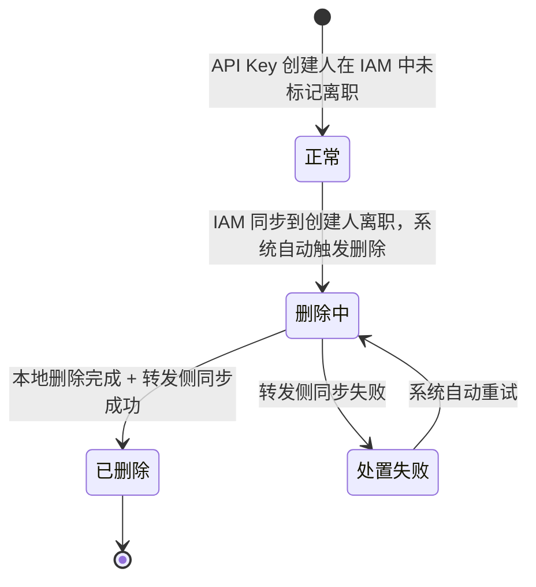

# F7. 离职资源清理

## 8.7.1 需求说明

- **功能目标**：基于 IAM 离职人员名单自动识别离职用户创建的 API Key，执行凭证级处置并同步转发侧，消除安全与费用风险。
- **触发条件**：定时任务同步到新的离职人员后，系统自动删除其创建的 API Key。
- **前置依赖**：IAM 人事资料接口可用（`POST /CRM_WebApi/api/GetCMSMV`）；部署级离职治理启用配置处于开启状态；Go 转发侧删除同步接口可用。
- **涉及角色**：系统（自动同步、识别、删除及失败重试）。本功能为纯后端能力，无租户管理员操作入口。

## 8.7.2 产品规则

- PR-7.1：离职人员由 IAM 或组织身份系统识别，模型平台不自行判定。
- PR-7.2：模型平台通过定时任务同步离职人员名单。
- PR-7.3：人事资料接口采用 `POST /CRM_WebApi/api/GetCMSMV`，通过 `Isresign=N` 查询离职人员；接口字段和同步方案见 [人员离职同步与离职资源清理设计](../../项目概览/model-ops-knowledge/projects/model-ops-platform/tech-specs/人员离职同步与离职资源清理设计.md)。
- PR-7.4：离职治理能力受部署级离职治理启用配置控制；关闭时不启动同步任务、不访问离职治理表，私有化部署可默认关闭且不建相关表。
- PR-7.5：API Key 是否属于离职资源，以 API Key 创建人为准。
- PR-7.6：不判断该 API Key 当前实际被哪个业务系统或人员使用。
- PR-7.7：默认策略——同步识别后直接删除离职人员创建的 API Key，不再经过"先禁用再删除"的中间环节。
- PR-7.8：特定 AI Coding 租户同样为直接删除，策略一致。
- PR-7.9：离职清理是凭证级处置，不产生资源关闭失效绑定。
- PR-7.10：离职人员信息同步完成后，系统自动触发 API Key 删除，不提供人工确认、查看或一键删除功能。
- PR-7.11：删除失败或转发侧同步失败时，由系统按重试策略自动重试，不提供人工重试入口。

## 8.7.3 边界条件与异常场景

- **IAM 不可用**：当 IAM 人事资料接口不可用或超时时，本次定时任务不执行离职处置；待下次同步任务执行时重新同步并处理。
- **启用配置关闭**：当部署级离职治理启用配置从开启切换为关闭时，停止后续离职人员同步及自动删除任务；重新开启后由后续同步任务继续处理。
- **删除与同步失败**：平台侧删除或转发侧同步失败时，本次任务标记为"处置失败"，系统按重试策略自动重试，直至删除及同步成功。

## 8.7.4 字段定义

### 后端处理字段表

| 字段 | 说明 | 是否本期新增 |
| ---- | ---- | ---- |
| 离职人员标识 | 工号、用户 ID / 邮箱、所属租户 | 否 |
| API Key 标识 | API Key ID、创建人、所属租户 | 否 |
| 处置状态 | 删除中 / 已删除 / 处置失败 | 是 |
| 转发侧同步状态 | 同步中 / 成功 / 失败 | 否 |
| 重试信息 | 重试次数、最近重试时间 | 是 |

## 8.7.5 后端处理流程

1. 定时任务从 IAM 同步离职人员信息。
2. 系统按 API Key 创建人匹配离职人员名下的 API Key。
3. 匹配成功后立即进入删除流程，不等待人工确认，也不生成前端待处理列表。
4. 平台侧删除完成后同步转发侧，双方均处理成功后结束流程。
5. 任一环节失败时记录处置状态，并由系统按重试策略自动重试。

## 8.7.6 状态流转

### 状态转移条件表

| 源状态 | 目标状态 | 转移条件 |
| ---- | ---- | ---- |
| 正常 | 删除中 | 定时任务同步到创建人离职信息后，系统自动触发删除 |
| 删除中 | 已删除 | 本地 API Key 删除完成 + 转发侧同步成功 |
| 删除中 | 处置失败 | 转发侧同步返回失败或超时 |
| 处置失败 | 删除中 | 系统按重试策略自动重试 |

## 8.7.7 验收标准

### 一、离职识别与自动删除（AC-7.1 ~ AC-7.4）

- [ ] **AC-7.1** Given IAM 返回离职人员；When 定时任务同步完成；Then 平台按 API Key 创建人识别其名下 API Key，并立即自动触发删除。
- [ ] **AC-7.2** Given 离职人员创建的 API Key 仍被业务系统使用；When 创建人被识别为离职；Then 该 API Key 进入离职资源清理流程。
- [ ] **AC-7.3** Given 系统识别到离职人员创建的 API Key；When 自动删除策略执行；Then 不经过禁用、待处理或人工确认环节。
- [ ] **AC-7.4** Given 离职清理完成；When 系统完成凭证级处置；Then 不产生资源关闭失效绑定记录。

### 二、配置控制（AC-7.5 ~ AC-7.6）

- [ ] **AC-7.5** Given 离职治理启用配置关闭；When 系统运行；Then 不启动离职同步及自动删除任务。
- [ ] **AC-7.6** Given 离职治理启用配置重新开启；When 后续定时同步任务执行；Then 系统继续识别并自动删除离职人员创建的 API Key。

### 三、异常处理（AC-7.7 ~ AC-7.8）

- [ ] **AC-7.7** Given IAM 接口不可用；When 定时同步任务执行；Then 本次不执行离职处置，待下次同步任务重试。
- [ ] **AC-7.8** Given 平台侧删除或转发侧同步失败；When 本次处置结束；Then 状态标记为"处置失败"，并由系统自动重试。

## 8.7.8 补充约束

- 离职同步任务频率建议不低于每日一次，高频场景可配置为每小时。
- 删除操作为不可逆操作，系统识别离职人员后直接执行，不提供人工操作入口。
- 自动重试应具备次数上限和间隔控制，避免持续失败造成任务堆积。

---

**上一章节**：[05_F6_用量视角与用户级Token限额.md](05_F6_用量视角与用户级Token限额.md)
**下一章节**：[07_F8_AI安全护栏接入点策略.md](07_F8_AI安全护栏接入点策略.md)
